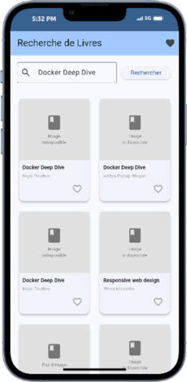
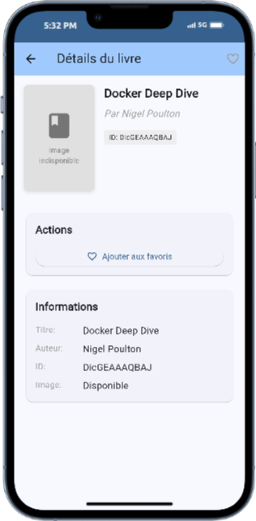

# 📚 Books App - Application Flutter de Recherche de Livres

Une application Flutter qui permet de découvrir des livres via l'API Google Books et de gérer une collection personnelle de favoris. Conçue avec Material 3.


## ✨ Fonctionnalités Principales

### 🔍 **Recherche Intelligente de Livres**
- **Recherche en temps réel** via l'API Google Books avec plus de 40 millions de livres
- **Résultats instantanés** avec affichage en grille responsive
- **Informations complètes** : titre, auteur, couverture et détails
- **Gestion d'erreurs** avec messages informatifs et possibilité de réessayer



### ❤️ **Gestion Avancée des Favoris**
- **Ajout/suppression instantané** avec un simple clic sur l'icône cœur
- **Stockage local persistant** : vos favoris restent même après fermeture de l'app
- **Synchronisation en temps réel** des statuts favoris sur toutes les pages
- **Page dédiée** pour consulter et organiser votre collection personnelle
- **Suppression sécurisée** avec confirmation pour éviter les erreurs


### 📖 **Pages de Détails Enrichies**
- **Vue détaillée** de chaque livre avec informations complètes
- **Images haute résolution** avec effets d'ombre élégants
- **Gestion des favoris** directement depuis la page de détails
- **Navigation fluide** avec retour automatique à la page précédente



### 📱 **Interface Utilisateur Moderne**
- **Design Material 3** avec thème cohérent et moderne
- **Responsive design** qui s'adapte à toutes les tailles d'écran
- **Navigation intuitive** entre les différentes sections
- **Animations fluides** et transitions élégantes
- **Gestion intelligente des images** avec placeholders informatifs
- **Messages de feedback** pour toutes les actions utilisateur

## 🏗️ Architecture

```
lib/
├── models/
│   └── book.dart              # Modèle de données Book
├── services/
│   ├── api_service.dart       # Service API Google Books
│   └── db_service.dart        # Service base de données SQLite
├── pages/
│   ├── home_page.dart         # Page de recherche principale
│   ├── detail_page.dart       # Page de détails d'un livre
│   └── favorites_page.dart    # Page des livres favoris
└── main.dart                  # Point d'entrée de l'application
```

## 🛠️ Technologies Utilisées

- **Flutter** - Framework de développement mobile
- **Dart** - Langage de programmation
- **Google Books API** - API de recherche de livres
- **SQLite** - Base de données locale pour les favoris
- **Material 3** - Design system moderne

## 📦 Dépendances

```yaml
dependencies:
  flutter:
    sdk: flutter
  http: ^1.2.2          # Appels API
  sqflite: ^2.4.1       # Base de données locale
  path: ^1.9.1          # Gestion des chemins
  cupertino_icons: ^1.0.8
```

## 🚀 Installation et Lancement

### Prérequis
- Flutter SDK (version 3.7.2 ou supérieure)
- Dart SDK
- Un émulateur Android/iOS ou un navigateur web

### Installation
1. Clonez le repository :
```bash
git clone <repository-url>
cd books
```

2. Installez les dépendances :
```bash
flutter pub get
```

3. Lancez l'application :
```bash
# Sur émulateur mobile
flutter run

# Sur navigateur web
flutter run -d chrome

# Sur serveur web local
flutter run -d web-server --web-port=8080
```
